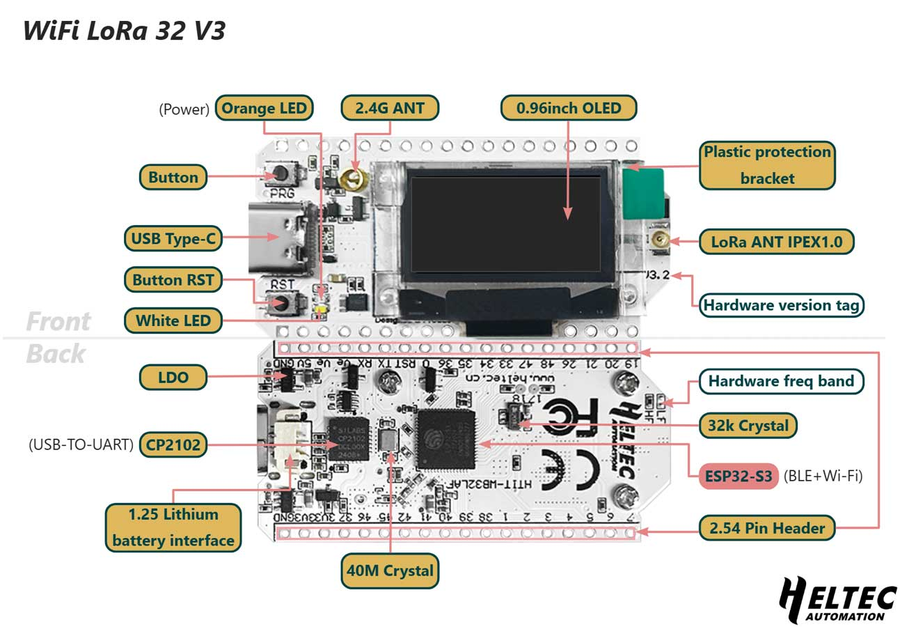

# Kamstrup Multical 21 water meter in Home Assistant (Wireless MBus)


### Features
 * Configuration ready for Home Assistan with MQTT.
 * Support for AES-128 decryption (with vaild key).
 * CRC Check of recived data.
 * Wireless reading of data.
 * Easy to build and configure.
 * **NEW**: Heltec V3 support with integrated SX1262 radio!


### Hardware Options

#### Option 1: ESP32-C3 + CC1101 (Original)
**Hardware Links** (from original author [@pthalin](https://github.com/pthalin)):\
[CC1101 Module](https://s.click.aliexpress.com/e/_oDW0qJ2) \
[ESP32-C3 Super Mini](https://s.click.aliexpress.com/e/_c3HOPvoX) \
Some cables

#### Option 2: Heltec WiFi LoRa 32 V3 (NEW!)
**Single integrated board** - no external wiring needed!



✅ ESP32-S3 (dual-core, more powerful)\
✅ SX1262 integrated radio (better sensitivity)\
✅ Built-in OLED display (shows readings in real-time!)\
✅ USB-C connector\
✅ Optional battery operation

**Buy:** [Heltec WiFi LoRa 32 V3](https://heltec.org/project/wifi-lora-32-v3/)\
**Docs:** [Heltec V3 Migration Guide](docs/HELTEC_V3_MIGRATION.md) | [Display Guide](docs/DISPLAY.md)

### Wiring

#### ESP32-C3 Super Mini + CC1101

| CC1101 | ESP32-C3 Super Mini |
| --- | --- |
| VCC | 3V3 |
| GND | GND |
| CSN | 7 |
| MOSI| 6 |
| MISO| 5 |
| SCK | 4 |
| GD0 | 10 |
| GD2 | Not Connected |

 

#### Heltec WiFi LoRa 32 V3

**No wiring needed!** The SX1262 radio is integrated on the board.

Just connect via USB-C for power and programming.

### Build and Upload Firmware

**Prerequisites:**
* Get your meter's decryption key (ask your water service provider)
* Read the serial number from your meter (typically S/N: XXXXXXXX/A/20)
* Install [VS Code](https://code.visualstudio.com/) and [PlatformIO](https://platformio.org/)

**Setup:**
1. Copy `src/credentials_template.h` to `src/credentials.h`
2. Edit `src/credentials.h`:
   - Add your WiFi credentials
   - Add MQTT broker details
   - Add meter serial number in **BCD format** (see template for examples)
   - Add your AES-128 decryption key

**Build and Upload:**
- Open the project folder in VS Code (File -> Open Folder...)
- Select your PlatformIO environment:
  - `esp32c3_supermini` - for ESP32-C3 + CC1101
  - `heltec_v3` - for Heltec WiFi LoRa 32 V3
- Connect your board via USB
- Build and upload: Ctrl+Alt+U (or click Upload in PlatformIO toolbar)

**Note**: For Heltec V3 setup details, see [Migration Guide](docs/HELTEC_V3_MIGRATION.md)

### Home Assistant

Setup [MQTT](https://www.home-assistant.io/integrations/mqtt/) if you don't already have it.

Add this to configuration.yaml
```
mqtt:
  sensor:
    - name: "Water Meter Usage"
      state_topic: "watermeter/0/sensor/mydatajson"
      unit_of_measurement: "m³"
      value_template: "{{ value_json.CurrentValue }}"
      device_class: water
      state_class: total_increasing
      availability:
        - topic: "watermeter/0/online"
          payload_available: "True"
          payload_not_available: "False"
    - name: "Water Meter Month Start Value"
      state_topic: "watermeter/0/sensor/mydatajson"
      unit_of_measurement: "m³"
      value_template: "{{ value_json.MonthStartValue }}"
      device_class: water
      state_class: total_increasing
    - name: "Water Meter Room Temperature"
      state_topic: "watermeter/0/sensor/mydatajson"
      value_template: "{{ value_json.RoomTemp }}"
      unit_of_measurement: "°C"
    - name: "Water Meter Water Temperature"
      state_topic: "watermeter/0/sensor/mydatajson"
      value_template: "{{ value_json.WaterTemp }}"
      unit_of_measurement: "°C"
```

## Support This Project

### Heltec V3 + Display Implementation
If the Heltec V3 migration or OLED display features helped you:
- ☕ [Buy me a coffee](https://ko-fi.com/antsman)
- 💳 [PayPal donation](https://paypal.me/namstna)

### Original Project
Support the original authors who made this possible:
- 💰 [Patrik (ESP32-C3 port)](https://ko-fi.com/patriksretrotech) | [PayPal](https://www.paypal.com/donate/?business=UCTJFD6L7UYFL&no_recurring=0&item_name=Please+support+me%21&currency_code=SEK)
- 🌟 Star [chester4444/esp-multical21](https://github.com/chester4444/esp-multical21) (original implementation)

## Credits

**This fork adds:**
- Heltec WiFi LoRa 32 V3 support with SX1262 radio
- Real-time OLED display with button navigation
- Enhanced MQTT configuration

**Based on excellent work by:**
- [@chester4444](https://github.com/chester4444/esp-multical21) - Original ESP8266/ESP32 implementation
- [@pthalin](https://github.com/pthalin/esp32-multical21) - ESP32-C3 port and improvements
